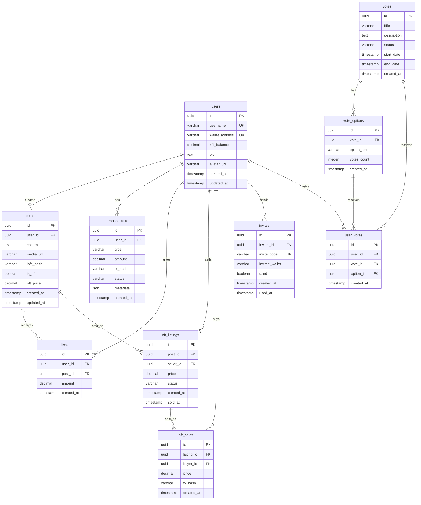

# Database Schema

## Обзор

KingFace использует PostgreSQL с Supabase для хранения данных. База данных спроектирована для Web3 соцсети с поддержкой токенов, NFT и транзакций.

## ER Diagram



## Таблицы

### users
Основная таблица пользователей.

```sql
CREATE TABLE users (
    id UUID PRIMARY KEY DEFAULT gen_random_uuid(),
    username VARCHAR(50) UNIQUE NOT NULL,
    wallet_address VARCHAR(44) UNIQUE NOT NULL,
    kftl_balance DECIMAL(20, 8) DEFAULT 0,
    bio TEXT,
    avatar_url VARCHAR(255),
    created_at TIMESTAMP DEFAULT NOW(),
    updated_at TIMESTAMP DEFAULT NOW()
);
```

**Индексы:**
```sql
CREATE INDEX idx_users_wallet_address ON users(wallet_address);
CREATE INDEX idx_users_username ON users(username);
CREATE INDEX idx_users_created_at ON users(created_at);
```

### posts
Посты пользователей.

```sql
CREATE TABLE posts (
    id UUID PRIMARY KEY DEFAULT gen_random_uuid(),
    user_id UUID REFERENCES users(id) ON DELETE CASCADE,
    content TEXT NOT NULL,
    media_url VARCHAR(255),
    ipfs_hash VARCHAR(255),
    is_nft BOOLEAN DEFAULT FALSE,
    nft_price DECIMAL(20, 8),
    created_at TIMESTAMP DEFAULT NOW(),
    updated_at TIMESTAMP DEFAULT NOW()
);
```

**Индексы:**
```sql
CREATE INDEX idx_posts_user_id ON posts(user_id);
CREATE INDEX idx_posts_created_at ON posts(created_at);
CREATE INDEX idx_posts_is_nft ON posts(is_nft);
```

### transactions
История транзакций KFTL токенов.

```sql
CREATE TABLE transactions (
    id UUID PRIMARY KEY DEFAULT gen_random_uuid(),
    user_id UUID REFERENCES users(id) ON DELETE CASCADE,
    type VARCHAR(20) NOT NULL, -- 'like', 'airdrop', 'transfer', 'mint', 'burn'
    amount DECIMAL(20, 8) NOT NULL,
    tx_hash VARCHAR(64),
    status VARCHAR(20) DEFAULT 'pending', -- 'pending', 'confirmed', 'failed'
    metadata JSONB,
    created_at TIMESTAMP DEFAULT NOW()
);
```

**Индексы:**
```sql
CREATE INDEX idx_transactions_user_id ON transactions(user_id);
CREATE INDEX idx_transactions_type ON transactions(type);
CREATE INDEX idx_transactions_status ON transactions(status);
CREATE INDEX idx_transactions_created_at ON transactions(created_at);
```

### likes
Лайки постов с количеством KFTL.

```sql
CREATE TABLE likes (
    id UUID PRIMARY KEY DEFAULT gen_random_uuid(),
    user_id UUID REFERENCES users(id) ON DELETE CASCADE,
    post_id UUID REFERENCES posts(id) ON DELETE CASCADE,
    amount DECIMAL(20, 8) NOT NULL,
    created_at TIMESTAMP DEFAULT NOW(),
    UNIQUE(user_id, post_id)
);
```

**Индексы:**
```sql
CREATE INDEX idx_likes_user_id ON likes(user_id);
CREATE INDEX idx_likes_post_id ON likes(post_id);
CREATE INDEX idx_likes_created_at ON likes(created_at);
```

### nft_listings
Листинги NFT для продажи.

```sql
CREATE TABLE nft_listings (
    id UUID PRIMARY KEY DEFAULT gen_random_uuid(),
    post_id UUID REFERENCES posts(id) ON DELETE CASCADE,
    seller_id UUID REFERENCES users(id) ON DELETE CASCADE,
    price DECIMAL(20, 8) NOT NULL,
    status VARCHAR(20) DEFAULT 'active', -- 'active', 'sold', 'cancelled'
    created_at TIMESTAMP DEFAULT NOW(),
    sold_at TIMESTAMP
);
```

**Индексы:**
```sql
CREATE INDEX idx_nft_listings_post_id ON nft_listings(post_id);
CREATE INDEX idx_nft_listings_seller_id ON nft_listings(seller_id);
CREATE INDEX idx_nft_listings_status ON nft_listings(status);
```

### nft_sales
История продаж NFT.

```sql
CREATE TABLE nft_sales (
    id UUID PRIMARY KEY DEFAULT gen_random_uuid(),
    listing_id UUID REFERENCES nft_listings(id) ON DELETE CASCADE,
    buyer_id UUID REFERENCES users(id) ON DELETE CASCADE,
    price DECIMAL(20, 8) NOT NULL,
    tx_hash VARCHAR(64),
    created_at TIMESTAMP DEFAULT NOW()
);
```

**Индексы:**
```sql
CREATE INDEX idx_nft_sales_listing_id ON nft_sales(listing_id);
CREATE INDEX idx_nft_sales_buyer_id ON nft_sales(buyer_id);
CREATE INDEX idx_nft_sales_created_at ON nft_sales(created_at);
```

### invites
Система приглашений.

```sql
CREATE TABLE invites (
    id UUID PRIMARY KEY DEFAULT gen_random_uuid(),
    inviter_id UUID REFERENCES users(id) ON DELETE CASCADE,
    invite_code VARCHAR(20) UNIQUE NOT NULL,
    invitee_wallet VARCHAR(44),
    used BOOLEAN DEFAULT FALSE,
    created_at TIMESTAMP DEFAULT NOW(),
    used_at TIMESTAMP
);
```

**Индексы:**
```sql
CREATE INDEX idx_invites_inviter_id ON invites(inviter_id);
CREATE INDEX idx_invites_invite_code ON invites(invite_code);
CREATE INDEX idx_invites_used ON invites(used);
```

### votes
Система голосования.

```sql
CREATE TABLE votes (
    id UUID PRIMARY KEY DEFAULT gen_random_uuid(),
    title VARCHAR(255) NOT NULL,
    description TEXT,
    status VARCHAR(20) DEFAULT 'active', -- 'active', 'closed', 'cancelled'
    start_date TIMESTAMP NOT NULL,
    end_date TIMESTAMP NOT NULL,
    created_at TIMESTAMP DEFAULT NOW()
);
```

**Индексы:**
```sql
CREATE INDEX idx_votes_status ON votes(status);
CREATE INDEX idx_votes_start_date ON votes(start_date);
CREATE INDEX idx_votes_end_date ON votes(end_date);
```

### vote_options
Варианты ответов для голосования.

```sql
CREATE TABLE vote_options (
    id UUID PRIMARY KEY DEFAULT gen_random_uuid(),
    vote_id UUID REFERENCES votes(id) ON DELETE CASCADE,
    option_text VARCHAR(255) NOT NULL,
    votes_count INTEGER DEFAULT 0,
    created_at TIMESTAMP DEFAULT NOW()
);
```

**Индексы:**
```sql
CREATE INDEX idx_vote_options_vote_id ON vote_options(vote_id);
```

### user_votes
Голоса пользователей.

```sql
CREATE TABLE user_votes (
    id UUID PRIMARY KEY DEFAULT gen_random_uuid(),
    user_id UUID REFERENCES users(id) ON DELETE CASCADE,
    vote_id UUID REFERENCES votes(id) ON DELETE CASCADE,
    option_id UUID REFERENCES vote_options(id) ON DELETE CASCADE,
    created_at TIMESTAMP DEFAULT NOW(),
    UNIQUE(user_id, vote_id)
);
```

**Индексы:**
```sql
CREATE INDEX idx_user_votes_user_id ON user_votes(user_id);
CREATE INDEX idx_user_votes_vote_id ON user_votes(vote_id);
CREATE INDEX idx_user_votes_option_id ON user_votes(option_id);
```

## Row Level Security (RLS)

### users
```sql
ALTER TABLE users ENABLE ROW LEVEL SECURITY;

-- Пользователи могут видеть свой профиль
CREATE POLICY "Users can view own profile" ON users
    FOR SELECT USING (auth.uid()::text = id::text);

-- Пользователи могут обновлять свой профиль
CREATE POLICY "Users can update own profile" ON users
    FOR UPDATE USING (auth.uid()::text = id::text);

-- Пользователи могут создавать свой профиль
CREATE POLICY "Users can insert own profile" ON users
    FOR INSERT WITH CHECK (auth.uid()::text = id::text);
```

### posts
```sql
ALTER TABLE posts ENABLE ROW LEVEL SECURITY;

-- Все могут видеть посты
CREATE POLICY "Anyone can view posts" ON posts
    FOR SELECT USING (true);

-- Пользователи могут создавать посты
CREATE POLICY "Users can create posts" ON posts
    FOR INSERT WITH CHECK (auth.uid()::text = user_id::text);

-- Авторы могут обновлять свои посты
CREATE POLICY "Authors can update posts" ON posts
    FOR UPDATE USING (auth.uid()::text = user_id::text);

-- Авторы могут удалять свои посты
CREATE POLICY "Authors can delete posts" ON posts
    FOR DELETE USING (auth.uid()::text = user_id::text);
```

### transactions
```sql
ALTER TABLE transactions ENABLE ROW LEVEL SECURITY;

-- Пользователи могут видеть свои транзакции
CREATE POLICY "Users can view own transactions" ON transactions
    FOR SELECT USING (auth.uid()::text = user_id::text);

-- Система может создавать транзакции
CREATE POLICY "System can create transactions" ON transactions
    FOR INSERT WITH CHECK (true);
```

## Views

### post_stats
Статистика постов с количеством лайков.

```sql
CREATE VIEW post_stats AS
SELECT 
    p.id,
    p.user_id,
    p.content,
    p.created_at,
    COUNT(l.id) as likes_count,
    SUM(l.amount) as total_likes_amount,
    u.username as author_username
FROM posts p
LEFT JOIN likes l ON p.id = l.post_id
LEFT JOIN users u ON p.user_id = u.id
GROUP BY p.id, p.user_id, p.content, p.created_at, u.username;
```

### user_stats
Статистика пользователей.

```sql
CREATE VIEW user_stats AS
SELECT 
    u.id,
    u.username,
    u.kftl_balance,
    COUNT(p.id) as posts_count,
    COUNT(l.id) as likes_given,
    SUM(l.amount) as total_likes_given,
    COUNT(DISTINCT l2.post_id) as posts_liked
FROM users u
LEFT JOIN posts p ON u.id = p.user_id
LEFT JOIN likes l ON u.id = l.user_id
LEFT JOIN likes l2 ON p.id = l2.post_id
GROUP BY u.id, u.username, u.kftl_balance;
```

## Functions

### update_user_balance
Обновление баланса пользователя.

```sql
CREATE OR REPLACE FUNCTION update_user_balance(
    user_uuid UUID,
    amount_change DECIMAL
) RETURNS DECIMAL AS $$
DECLARE
    new_balance DECIMAL;
BEGIN
    UPDATE users 
    SET kftl_balance = kftl_balance + amount_change,
        updated_at = NOW()
    WHERE id = user_uuid
    RETURNING kftl_balance INTO new_balance;
    
    RETURN new_balance;
END;
$$ LANGUAGE plpgsql;
```

### create_like_transaction
Создание транзакции лайка.

```sql
CREATE OR REPLACE FUNCTION create_like_transaction(
    from_user UUID,
    to_post UUID,
    like_amount DECIMAL
) RETURNS UUID AS $$
DECLARE
    post_owner UUID;
    transaction_id UUID;
BEGIN
    -- Получить владельца поста
    SELECT user_id INTO post_owner FROM posts WHERE id = to_post;
    
    -- Создать транзакцию
    INSERT INTO transactions (user_id, type, amount, status, metadata)
    VALUES (from_user, 'like', like_amount, 'confirmed', 
            jsonb_build_object('post_id', to_post, 'post_owner', post_owner))
    RETURNING id INTO transaction_id;
    
    -- Обновить балансы
    PERFORM update_user_balance(from_user, -like_amount);
    PERFORM update_user_balance(post_owner, like_amount);
    
    RETURN transaction_id;
END;
$$ LANGUAGE plpgsql;
```

## Triggers

### update_updated_at
Автоматическое обновление updated_at.

```sql
CREATE OR REPLACE FUNCTION update_updated_at_column()
RETURNS TRIGGER AS $$
BEGIN
    NEW.updated_at = NOW();
    RETURN NEW;
END;
$$ LANGUAGE plpgsql;

CREATE TRIGGER update_users_updated_at
    BEFORE UPDATE ON users
    FOR EACH ROW
    EXECUTE FUNCTION update_updated_at_column();

CREATE TRIGGER update_posts_updated_at
    BEFORE UPDATE ON posts
    FOR EACH ROW
    EXECUTE FUNCTION update_updated_at_column();
```

### update_vote_count
Обновление счетчика голосов.

```sql
CREATE OR REPLACE FUNCTION update_vote_count()
RETURNS TRIGGER AS $$
BEGIN
    IF TG_OP = 'INSERT' THEN
        UPDATE vote_options 
        SET votes_count = votes_count + 1
        WHERE id = NEW.option_id;
        RETURN NEW;
    ELSIF TG_OP = 'DELETE' THEN
        UPDATE vote_options 
        SET votes_count = votes_count - 1
        WHERE id = OLD.option_id;
        RETURN OLD;
    END IF;
    RETURN NULL;
END;
$$ LANGUAGE plpgsql;

CREATE TRIGGER update_vote_count_trigger
    AFTER INSERT OR DELETE ON user_votes
    FOR EACH ROW
    EXECUTE FUNCTION update_vote_count();
```

## Миграции

### Создание миграции
```bash
# Создать новую миграцию
alembic revision -m "add_nft_tables"

# Применить миграции
alembic upgrade head

# Откатить миграцию
alembic downgrade -1
```

### Пример миграции
```python
# migrations/versions/001_add_nft_tables.py
from alembic import op
import sqlalchemy as sa

def upgrade():
    op.create_table(
        'nft_listings',
        sa.Column('id', sa.UUID(), nullable=False),
        sa.Column('post_id', sa.UUID(), nullable=False),
        sa.Column('seller_id', sa.UUID(), nullable=False),
        sa.Column('price', sa.DECIMAL(20, 8), nullable=False),
        sa.Column('status', sa.String(20), nullable=False, default='active'),
        sa.Column('created_at', sa.TIMESTAMP(), nullable=False, default=sa.func.now()),
        sa.Column('sold_at', sa.TIMESTAMP(), nullable=True),
        sa.ForeignKeyConstraint(['post_id'], ['posts.id'], ondelete='CASCADE'),
        sa.ForeignKeyConstraint(['seller_id'], ['users.id'], ondelete='CASCADE'),
        sa.PrimaryKeyConstraint('id')
    )

def downgrade():
    op.drop_table('nft_listings')
```

## Бэкапы

### Автоматические бэкапы
```sql
-- Создать бэкап
pg_dump $DATABASE_URL > backup_$(date +%Y%m%d_%H%M%S).sql

-- Восстановить бэкап
psql $DATABASE_URL < backup_file.sql
```

### Supabase бэкапы
- Автоматические бэкапы каждые 24 часа
- Хранение 7 дней
- Point-in-time recovery доступен